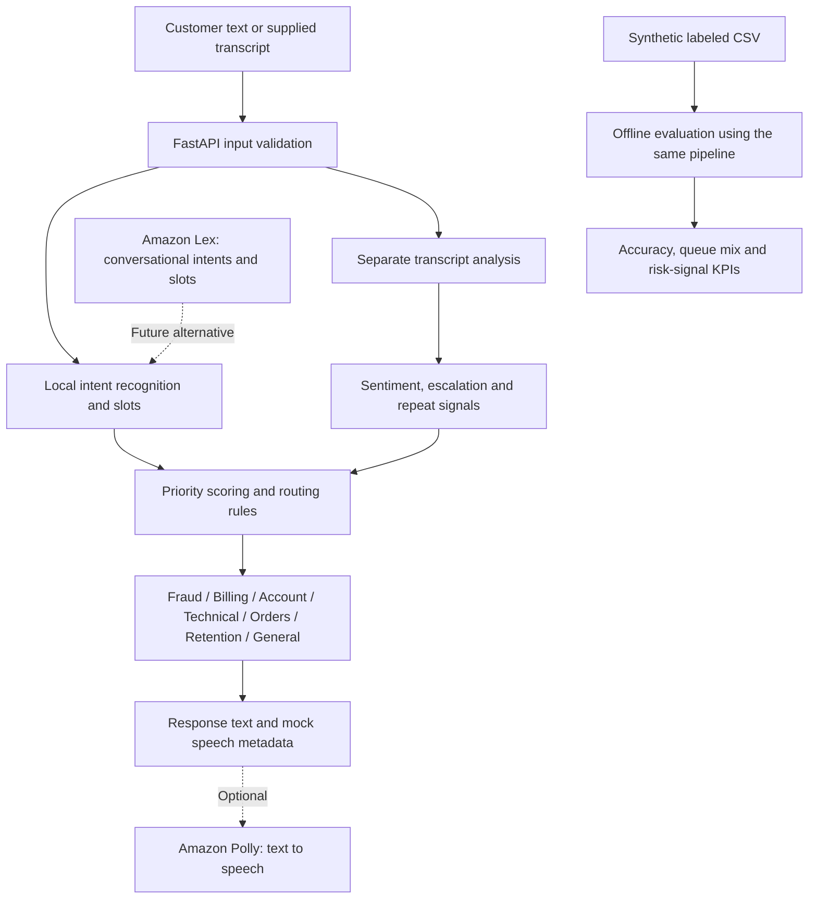

# Contact-Center Interaction Router

**Understand → Prioritize → Route → Respond → Analyze**

A runnable Python/FastAPI portfolio project that recommends the right support queue, explains its priority decisions, and turns synthetic customer messages into operational insights. Run everything locally, with no AWS account, credentials, paid APIs, model downloads, or database.

> This is an educational prototype with deterministic English rules. It does not connect callers to agents, perform financial actions, generate audio, or claim production performance. Amazon Lex and Polly are optional future integrations, not services running behind this demo.

## What it demonstrates

- Lex-style intent recognition with evidence, multiple matched intents, and an explicit fallback.
- Slot extraction for USD amounts, order IDs, and raw date mentions.
- Explainable priority scoring and specialist queue recommendations.
- Separate sentiment, escalation-risk, and repeat-contact heuristics.
- Stateless API with validated input and interactive Swagger documentation.
- Thirty fully synthetic, labeled interactions and a reproducible KPI report.
- Automated unit/API tests and a GitHub Actions Python matrix.

## Architecture



**Amazon Lex handles conversational intent understanding and slots. Amazon Polly converts response text to speech. Polly does not perform sentiment analysis.** This repository implements sentiment analysis independently as transparent text heuristics. See [AWS integration notes](docs/aws-integration.md) for official references and extension boundaries.

## Quick start

Requires **Python 3.10+** and Git. Run commands from the repository root.

```bash
git clone https://github.com/mrunaltayade3-eng/contact-center-interaction-router.git
cd contact-center-interaction-router
python -m venv .venv
source .venv/bin/activate
# Windows PowerShell: .venv\Scripts\Activate.ps1
python -m pip install -e '.[dev]'
python -m uvicorn app.main:app --reload --host 127.0.0.1 --port 8000
```

Open [interactive API docs](http://127.0.0.1:8000/docs). Check [health](http://127.0.0.1:8000/health). Installation requires internet access to PyPI; runtime works offline. For runtime dependencies only, use `python -m pip install -e .`.

## Try the API

```bash
curl -X POST http://127.0.0.1:8000/route \
  -H 'Content-Type: application/json' \
  -d '{"customer_id":"DEMO-001","message":"I was charged twice for order #AB-123 yesterday.","previous_contacts":0}'
```

The exact response is saved in [sample-response.json](docs/sample-response.json). Its key fields are:

```json
{
  "customer_id": "DEMO-001",
  "priority_score": 50,
  "priority": "high",
  "queue": "billing"
}
```

The full response also includes intent evidence, extracted slots, sentiment, repeat-contact and escalation signals, score reasons, generated response text, and `speech.audio_generated: false`.

Try a critical escalation:

```bash
curl -X POST http://127.0.0.1:8000/route \
  -H 'Content-Type: application/json' \
  -d '{"customer_id":"DEMO-002","message":"Unauthorized charge. I am frustrated and need a supervisor immediately.","previous_contacts":2}'
```

This recommends the fraud queue with a capped score of 100 and escalation risk enabled. Escalation increases urgency while preserving specialist ownership.

| Endpoint | Purpose |
| --- | --- |
| `GET /health` | Local-mode health check |
| `POST /route` | Analyze and recommend a queue without persisting data |
| `GET /docs` | Interactive API documentation |
| `GET /openapi.json` | Machine-readable API schema |

Blank IDs/messages, negative or non-integer contact counts, unknown fields, and messages over 4,000 characters return HTTP 422. `previous_contacts` is the caller-supplied number of earlier contacts about the same issue; it defaults to zero. Repeated API calls do not accumulate history.

## Decision rules

| Intent | Queue | Base score |
| --- | --- | ---: |
| fraud | fraud | 80 |
| payment_dispute | billing | 50 |
| refund_request | billing | 30 |
| account_access | account | 30 |
| technical_support | technical | 30 |
| order_status | orders | 10 |
| cancellation | retention | 20 |
| unknown | general_support | 20 |

Add **10** for negative/mixed sentiment, **15** for a repeat-contact signal, **20** for escalation risk, and **10** for urgency language. Cap at 100. Priorities: low 0–24, medium 25–49, high 50–79, critical 80–100. These are illustrative business rules, not probabilities or calibrated risk scores.

When multiple intents match, the first matching intent in the table wins; fraud takes precedence. All matches remain visible. Escalation risk means a supervisor phrase, two or more provided prior contacts, or negative language combined with a repeat signal. Repeat detection uses provided history or phrases such as “calling again” and “third time.” It does not infer actual customer history from an identifier.

Amounts remain strings to preserve decimals. Relative dates stay raw (`yesterday`); they are not converted to calendar dates. Order IDs require `order #...` or `order ID ...`.

## Tests and KPI analysis

```bash
python -m pytest -q
python -m app.kpis --input data/sample_interactions.csv --output reports/kpis.json
```

See the checked-in [sample KPI report](docs/sample-kpis.json). The data intentionally includes four paraphrases the matcher misses, so evaluation exposes its limitations. It is a hand-authored demonstration set, not an independent benchmark.

| KPI | Definition |
| --- | --- |
| Intent accuracy | Correct predicted intents / all rows |
| Routing accuracy | Correct recommended queues / all rows |
| Repeat-contact signal rate | Rows with history or a repeat phrase / all rows |
| Escalation-risk rate | Rows flagged by escalation rules / all rows |
| Negative/mixed sentiment rate | Rows with negative or mixed language / all rows |
| Queue/priority distributions | Count of recommendations in each category |
| Repeat signals by queue | Flagged interaction counts grouped by recommended queue |

Rates are fractions from 0 to 1; empty datasets return null rates. Every row is an interaction, not a unique customer or an issue. Duplicate interaction IDs are rejected by the CLI. Expected labels are used only for evaluation and are never passed to the router. CSV input must contain the columns shown in the sample file; contact counts must be valid nonnegative integers.

**No demonstrated 20% transfer reduction or 14% repeat-contact reduction is claimed.** Those outcomes require real before/after observations, consistent definitions, and suitable controls. Actual transfer rate, first-contact resolution, average handling time, and repeat contacts within a time window are not measurable from this dataset. See [measurement plan](docs/measurement-plan.md).

## Repository map

```text
app/
  main.py             FastAPI endpoints
  models.py           Validated request/response contracts
  intent_engine.py    Phrase matching and slot extraction
  sentiment.py        Transcript and repeat-contact signals
  router.py           Priority rules and response generation
  kpis.py             Offline CSV evaluation CLI
data/                 Synthetic labeled interactions
docs/                 Example outputs, AWS notes, measurement plan
tests/                Intent, routing, validation, API, KPI tests
.github/workflows/    Automated CI tests
pyproject.toml        Package metadata and dependencies
```

## Limits and production considerations

This English phrase matcher misses paraphrases, sarcasm, general negation, and context. For example, “my card went missing” currently falls back to general support; even “this is not fraud” matches the fraud keyword. The latter favors review but demonstrates why production needs a validated language model and human fallback. Sentiment is similarly approximate. No score is model confidence.

There is no audio input, conversational session management, persistent history, queue capacity management, agent integration, authentication, rate limiting, or durable event store. Bind locally as shown. A deployment would need these controls plus request-size limits at the ingress, monitoring, PII redaction, retention rules, and careful evaluation. Do not put real customer transcripts, secrets, or payment-card details into the sample dataset. Dependencies use compatible version ranges; a production release should maintain a reviewed lockfile.

## Roadmap

- [x] Runnable local routing pipeline and validated REST API.
- [x] Synthetic data, explainable decisions, and reproducible KPI analysis.
- [x] Tests and CI.
- [ ] Independent labeled evaluation set, per-intent recall, and ambiguity review.
- [ ] Provider interface and opt-in Amazon Lex V2 integration.
- [ ] Opt-in Amazon Polly audio responses with explicit cost/error handling.
- [ ] Issue-level contact history with a defined time window and idempotent events.
- [ ] Human escalation workflow, live queue adapters, and operational dashboard.
- [ ] Measured pilot with monitored misrouting, fairness, latency, and business outcomes.

## Concise interview explanation

“I built a local contact-center routing prototype with FastAPI. It detects intents and slots, combines urgency, sentiment, and repeat-contact signals into an explainable priority score, and recommends a specialist queue. I separated transcript analytics from response generation and evaluated the rules on synthetic labeled interactions. The design allows future Amazon Lex integration for conversational understanding and Amazon Polly for text-to-speech. This demo establishes the pipeline and measurement approach; it does not establish real-world transfer or repeat-contact reductions.”
